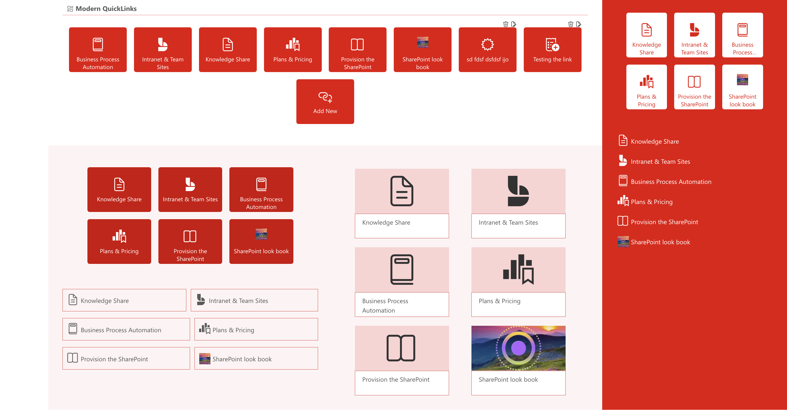

# Modern QuickLinks

## Introduction

Modern QuickLinks is the ultimate SharePoint web part that takes your quick links to the next level. While retaining the familiar functionality of the out-of-the-box QuickLinks, Modern QuickLinks offers a range of advanced features designed to enhance user experience and flexibility. Elevate your SharePoint experience with Modern QuickLinks, where enhanced functionality meets modern design.

#### Trial License Key - tWQD9k5ceFbq2tvdnZr57vaVtH29TbqK6SmLKGnieARdjugYpB

## Features

- **Customizable Layouts** - Modern QuickLinks provides customizable layouts for creative presentations, allowing users to tailor the display of their links in an aesthetically pleasing manner.

- **Flexible Canvas Support** - This web part supports different canvas sizes within the section, section backgrounds, and theme colors, giving users the flexibility to design as per their needs.

- **Easy Link Maintenance** - Links can be easily maintained via a SharePoint list, simplifying management and updates. 

- **User and Global Links Differentiation** - The same web part can differentiate between global links and user-specific links based on the current user, ensuring a personalized experience. 

- **User-Friendly Link Management** - Users can maintain their links without having to edit the page or navigate to the lists, making it user-friendly and efficient. 

- **Fast Loading with Cache Mechanism** - A property to utilize a cache mechanism is available for fast loading of links, enhancing performance. 

- **Sorting Capabilities** - Links can be sorted based on a list of fields from the web part properties, offering organized access. 

- **Link Restriction** - The feature to restrict the total number of links for users prevents cluttering the section or pages with too many links. 

- **Reusability** - Modern QuickLinks can be reused any number of times within the same page or on different pages with the same or different lists, ensuring versatility. 

- **Administrative Options** - Administrators have the option to create the required list, providing better control and management. 

- **Support for Full Bleed** - You can add this web part like banner in a page which covers the full width of the page. 

- **Icon and Image Choices** - Users have the choice to use either fabric icons or images for their links, offering customization and personalization options. 

## Used SharePoint Framework Version

## Solution

| Solution    | Author(s)                                               |
| ----------- | ------------------------------------------------------- |
| modern-quicklinks | Sudharsan K. (NTT DATA LTD, [Knowledge Share](https://spknowledge.com/) [@sudharsank](https://x.com/sudharsank)) |

## Disclaimer

**THIS CODE IS PROVIDED _AS IS_ WITHOUT WARRANTY OF ANY KIND, EITHER EXPRESS OR IMPLIED, INCLUDING ANY IMPLIED WARRANTIES OF FITNESS FOR A PARTICULAR PURPOSE, MERCHANTABILITY, OR NON-INFRINGEMENT.**

---

## Minimal Path to Awesome

- Clone this repository
- Ensure that you are at the solution folder
- in the command-line run:
  - **npm install**
  - **gulp serve**

> Please refer the below link for full documenation and the features in detail
[Modern QuickLinks Documation](https://spknowledge.com/2024/09/14/modern-quicklinks-sharepoint-web-part/)

## References

- [Getting started with SharePoint Framework](https://docs.microsoft.com/en-us/sharepoint/dev/spfx/set-up-your-developer-tenant)
- [Building for Microsoft teams](https://docs.microsoft.com/en-us/sharepoint/dev/spfx/build-for-teams-overview)
- [Use Microsoft Graph in your solution](https://docs.microsoft.com/en-us/sharepoint/dev/spfx/web-parts/get-started/using-microsoft-graph-apis)
- [Publish SharePoint Framework applications to the Marketplace](https://docs.microsoft.com/en-us/sharepoint/dev/spfx/publish-to-marketplace-overview)
- [Microsoft 365 Patterns and Practices](https://aka.ms/m365pnp) - Guidance, tooling, samples and open-source controls for your Microsoft 365 development
